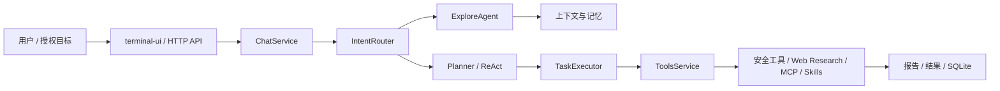

SecBot 是一个 AI 驱动的授权安全自动化工作台：NestJS 后端、Ink 终端 UI、多智能体编排、内置安全工具链、Skills 与 MCP 能力共同组成完整工作流。

> 本工具仅用于已获得明确授权的安全测试、研究与教学。请勿对未授权目标进行扫描、利用或远程控制。

本文档不再按历史发布分支堆叠页面，而是按读者任务组织：

<DocsGrid>
  <DocsCard
    href="/docs/ecosystem"
    eyebrow="认识"
    title="认识 SecBot"
    description="产品线、授权边界、发布策略，以及为什么 runtime 在这里代表内部执行链路。"
  />
  <DocsCard
    href="/docs/secbot"
    eyebrow="使用"
    title="开始使用"
    description="安装、快速开始、TUI、环境变量、LLM 配置、API 与部署。"
  />
  <DocsCard
    href="/docs/runtime"
    eyebrow="执行"
    title="运行与执行"
    description="Agent 编排、工具执行、Skills/MCP、工具扩展、记忆系统与设计范式。"
  />
</DocsGrid>

## 推荐阅读路径

| 你想完成的事 | 推荐路径 |
| --- | --- |
| 第一次运行 SecBot | [安装](/docs/secbot/installation) -> [快速开始](/docs/secbot/quick-start) -> [终端界面](/docs/secbot/terminal-ui) |
| 配置模型与环境 | [环境变量](/docs/secbot/environment-variables) -> [LLM 配置](/docs/secbot/llm-providers) |
| 做 API 或服务端集成 | [API 接口](/docs/secbot/api) -> [部署](/docs/secbot/deployment) |
| 理解执行链路 | [执行模型](/docs/ecosystem/execution-model) -> [Agent 编排](/docs/runtime/agent-orchestration) -> [工具清单](/docs/runtime/tools) |
| 扩展工具或 Skills | [工具扩展](/docs/runtime/tool-extension) -> [Skills 与 MCP](/docs/runtime/skills-and-mcp) -> [技能与记忆系统](/docs/runtime/memory) |
