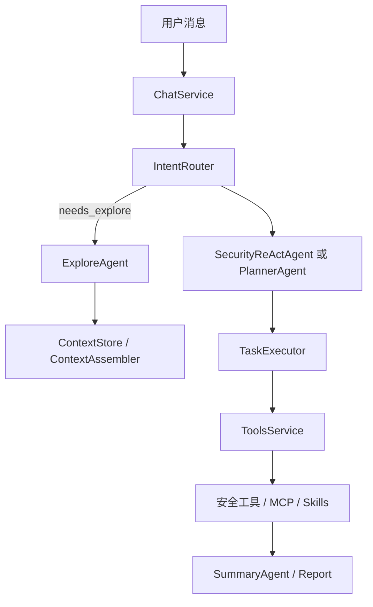

本节解释 SecBot 如何把用户意图变成可观察、可审计的安全自动化执行链路。这里的 runtime 是文档分区名，表示内部运行与执行层，不对应独立仓库。

<DocsGrid>
  <DocsCard href="/docs/runtime/agent-orchestration" eyebrow="编排" title="Agent 编排" description="IntentRouter、ExploreAgent、Planner、TaskExecutor、SummaryAgent 与 SSE 事件。"/>
  <DocsCard href="/docs/runtime/tools" eyebrow="工具" title="工具清单" description="security、web-research、vuln-db、protocol、osint、cloud、defense 等工具类别。"/>
  <DocsCard href="/docs/runtime/skills-and-mcp" eyebrow="Skills" title="Skills 与 MCP" description="REST、TUI、CLI、Agent 工具统一 Skills 层和 secbot-mcp。"/>
  <DocsCard href="/docs/runtime/tool-extension" eyebrow="扩展" title="工具扩展" description="实现 BaseTool、注册分类、验证工具列表和敏感工具维护。"/>
  <DocsCard href="/docs/runtime/memory" eyebrow="记忆" title="技能与记忆系统" description="短期、情景、长期记忆与向量检索 API。"/>
  <DocsCard href="/docs/runtime/design-paradigms" eyebrow="范式" title="设计范式" description="Agent 架构、ReAct、事件总线、配置、提示词和插件系统经验。"/>
</DocsGrid>

## 执行链路

